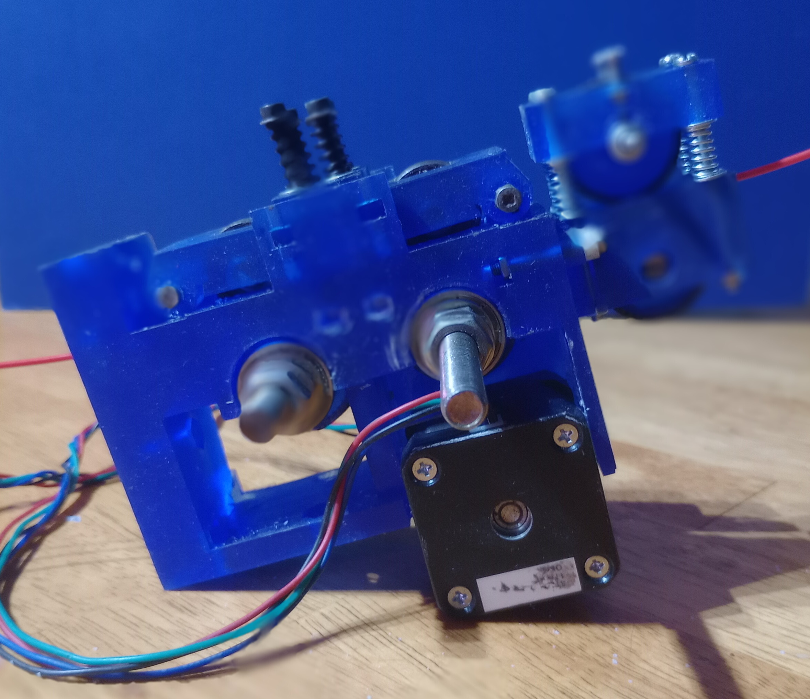

# DoublyDrivenExtruder
Two bolts drive the drive_pulleys that drives the filament into the hotend . Driven by a gear set and belt and one nema17motor.

Pressure Adjuster
Reduces pressure in rotations of stepper.

Feedrate Sensor
Uses a continually rotating high precision 100K potientiometer

Marlin Firmware and Closed Loop Stepper Motor
https://reprap.org/forum/read.php?415,855273

Marlin/Marlin/Configuration_adv.h
```
// Employ an external closed loop controller. Override pins here if needed.
//#define EXTERNAL_CLOSED_LOOP_CONTROLLER
#if ENABLED(EXTERNAL_CLOSED_LOOP_CONTROLLER)
  //#define CLOSED_LOOP_ENABLE_PIN        -1
  //#define CLOSED_LOOP_MOVE_COMPLETE_PIN -1
#endif
```
Extruder(E0) Enable Pin
External Pin to signal move complete

<div align="center">
     
</div>
<div align="center">
     
</div>

## TODO
1. Make primary driver gear smaller to prevent colliding with secondary Driver shaft.
2. Update nut captures hinge spring m3 bolts x 4. Nut captures too small.
3. Use two lock nuts to secure the drive_pulley.
4. Bearing Housings .1 -.2 smaller radius
5. External pulleys resize larger to fit 130mm or 140mm belt gt2 6mm thick.
6. Redesign drive_pulley for gt2 belt capture inside pulley


<div align="center">
     
</div>

<div align="center">
     
</div>

<div align="center">
     
</div>

<div align="center">
     
</div>

<div align="center">
     
</div>


## doublydrivenextruder-test

Operates Hotend with a TemperatureController
Uses two Steppers one for drive and one for pressure adjustment.
Reads the analog port feedrate sensor.

Uses a timer interrupt.


```

/*
 * Using accelerated motion ("linear speed") in nonblocking mode
 *
 * Copyright (C)2015-2017 Laurentiu Badea
 *
 * This file may be redistributed under the terms of the MIT license.
 * A copy of this license has been included with this distribution in the file LICENSE.
 */
#include <Arduino.h>
#include <TimerOne.h>
// EPCOS 100K Thermistor #3(B57560G104F)
// Made with createTemperatureLookup.py (http://svn.reprap.org/trunk/reprap/firmware/Arduino/utilities/createTemperatureLookup.py)
// ./createTemperatureLookup.py --r0=100000 --t0=25 --r1=0 --r2=4700 --beta=4036 --max-adc=1023
// r0: 100000
// t0: 25
// r1: 0
// r2: 4700
// beta: 4036
// max adc: 1023
#define NUMTEMPS 20
// {ADC, temp }, // temp
float temptable1[20]={
    864.165363324,
    258.53991594, 
   211.310066205 ,
    185.861725716 ,
    168.31793816, 
   154.754297589 ,
   143.52544406 ,
    133.784751118, 
   125.033500921 ,
    116.945124847 ,
    109.283980973 ,
   101.861768746 ,
    94.5095302806 ,
   87.0542728805 ,
    79.2915563492 ,
    70.9409729952,
    61.5523326183 ,
   50.25271896 ,
    34.7815846664, 
   2.86606331838 
};

int temptable2[]={1,54,107,160,213,266,319,372,425,478,531,584,637,690,743,796,849,902,955,1008};

unsigned int timer_count=0;
unsigned int period=256;
unsigned int ticks_on=0;
// Motor steps per revolution. Most steppers are 200 steps or 1.8 degrees/step
#define MOTOR_STEPS 200
// Target RPM for cruise speed
#define RPM 120
// Acceleration and deceleration values are always in FULL steps / s^2
#define MOTOR_ACCEL 2000
#define MOTOR_DECEL 1000

// Microstepping mode. If you hardwired it to save pins, set to the same value here.
#define MICROSTEPS 16

#define DIR 8
#define STEP 9
#define SLEEP 13 // optional (just delete SLEEP from everywhere if not used)

/*
 * Choose one of the sections below that match your board
 */

//#include "DRV8834.h"
//#define M0 10
//#define M1 11
//DRV8834 stepper(MOTOR_STEPS0, DIR0, STEP0, SLEEP0, M00, M10);
//DRV8834 stepper(MOTOR_STEPS1, DIR1, STEP1, SLEEP1, M01, M11);

 #include "A4988.h"

 #define MS1 10
 #define MS2 11
 #define MS3 12
 A4988 stepper1(MOTOR_STEPS, DIR, STEP, SLEEP, MS1, MS2, MS3);
 A4988 stepper2(MOTOR_STEPS, DIR, STEP, SLEEP, MS1, MS2, MS3);

// #include "DRV8825.h"
// #define MODE0 10
// #define MODE1 11
// #define MODE2 12
// DRV8825 stepper(MOTOR_STEPS, DIR, STEP, SLEEP, MODE0, MODE1, MODE2);

// #include "DRV8880.h"
// #define M0 10
// #define M1 11
// #define TRQ0 6
// #define TRQ1 7
// DRV8880 stepper(MOTOR_STEPS, DIR, STEP, SLEEP, M0, M1, TRQ0, TRQ1);

// #include "BasicStepperDriver.h" // generic
// BasicStepperDriver stepper(MOTOR_STEPS, DIR, STEP);


int i=-1;
int MM_ROT=15.7;
int MM_MIN=50;
float k=1.0;
int temptable2[]={1,54,107,160,213,266,319,372,425,478,531,584,637,690,743,796,849,902,955,1008};

unsigned int timer_count=0;
unsigned int period=256;
unsigned int ticks_on=124;
set_temperature=230;
float move_millimeters=10;//mm
float move_steps=200.0*(move_millimeters)/15.7;
int step = 0;
int value0=0;
int value1=0;
int old_value=0;
float moved_millimeters=0.0;
int counter=10;
float temperature=0;

void hotend(){////////////////////////////////////////////////////////////////

    //hotend
   int i=0;
  int adc=analogRead(A15);
  while(adc>=temptable2[i]){i++;if(i>20)break;
   
  if(i>=19)i=19;
  float m=(temptable1[i]-temptable1[i+1])/(temptable2[i]-temptable2[i+1]);
  
  temperature=m*(adc-temptable2[i+1])+(float)temptable1[i+1];
 
  if(temperature>(set_temperature+0.5)){ticks_on=0;counter--;}
  else if((temperature-set_temperature)>1.0){ticks_on=124;}
  else counter++;

  if(counter==0)counter=1;
}/////////////////////////////////////////////////////////////////////////////


void setup() {//////////////////////////////////////////////////////////////
  Serial.begin(115200);

  pinMode(D10,OUTPUT);//thermistor pullups
  
  
  digitalWrite(D10,LOW);

  
  Timer1.initialize(300000);
  Timer1.attachInterrupt(tick);


  while(counter>1)hotend();

  
    //convert change in angle (6.28*2.5)mm/200 steps, 
    //MM_ROT=15.7 //mm per rotation
    // MM_MIN=50 //mm per minute
    stepper1.begin(MM_MIN/MM_ROT, MICROSTEPS);
    // if using enable/disable on ENABLE pin (active LOW) instead of SLEEP uncomment next line
    // stepper.setEnableActiveState(LOW);
    stepper1.enable();
    // set current level (for DRV8880 only). Valid percent values are 25, 50, 75 or 100.
    // stepper.setCurrent(100);
    stepper2.begin(120,MICROSTEPS);
    stepper2.enable();
    /*
     * Set LINEAR_SPEED (accelerated) profile.
     */
    stepper1.setSpeedProfile(stepper.LINEAR_SPEED, MOTOR_ACCEL, MOTOR_DECEL);

   
  stepper1.(move_steps);
  stepper2.rotate(3*360);
}


void loop() {


    if(counter<2){
        noInterrupts();
        if(stepper2.getcurrent()==STOPPED){
          stepper2.rotate(i*3*360);
          i=i*(-1);
        }
           //read analog 4096 values //2 *pi *6mm/4096
        value0=read_analog();
        if(value0>old_value){
          moved_mm=(value0-old_value)*2*pi*6/4096;
          moved_millimeteres+=move_mm;
        }
        
         calculated_millimeteres=15.7*steps/200;
        
        lag_mm=calculated_millimeteres-moved_millimeters;
        
        MM_MIN+=lag_mm*k
        stepper1.setRpm(MM_MIN);
        
        value0=old_value;
        unsigned wait_time1 = stepper1.nextAction();
        unsigned wait_time2 = stepper2.nextAction();
        if(wait_time>0)step++;
    
        if(wait_time1>80 && wait_time2>80){
          hotend();
          char buffer[40];
          sprintf(buffer, "%.2f %.2f %.2f %.2f",temperature,moved_millimeteres,lag_mm,MM_MIN);
          Serial.println(buffer);
        }      
        interrupts();
  }
  else {
    
    while(counter>1)hotend();


  }
  }
}


void tick(){///////////////////////////////////////////

  
          timer_count++;  
        
        if(timer_count==ticks_on){
          digitalWrite(D10,LOW);
          }
   
     
        if(timer_count==period && ticks_on!=0){
         digitalWrite(D10,HIGH);
         timer_count=0;
          }


}///////////////////////////////////////////////////////


```
